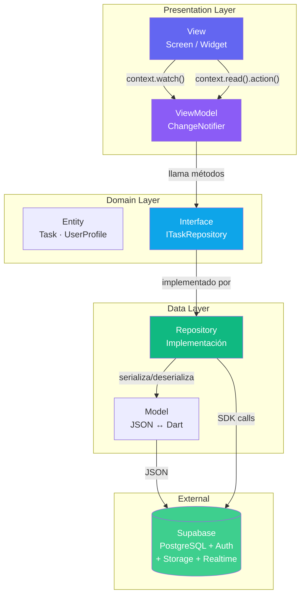
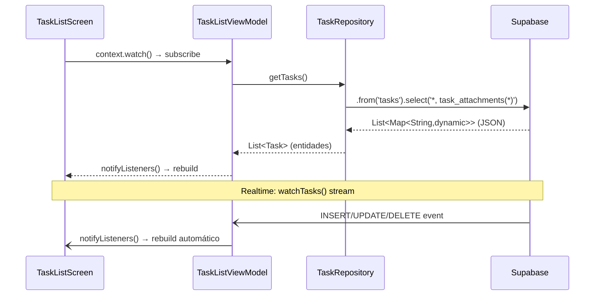
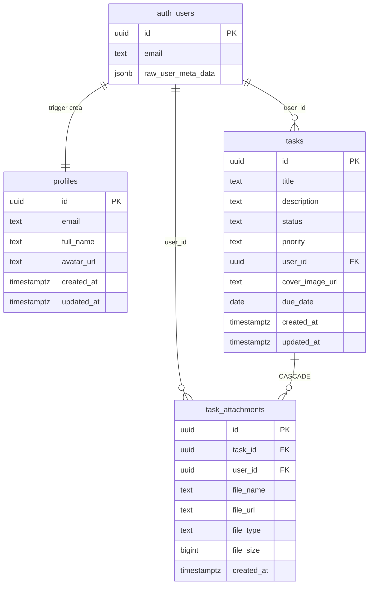

# TaskBoard — Flutter + Supabase

> Aplicación educativa de gestión de tareas estilo mini-Trello.  
> Diseñada para el curso **Desarrollo de Aplicaciones Multiplataforma**.

---

## ¿Qué aprenderás con este proyecto?

| Tema Flutter | Tema Supabase |
|---|---|
| Patrón MVVM con `provider` | Auth: email/password + OAuth |
| Navegación declarativa con GoRouter | Database: CRUD con PostgREST |
| Formularios y validación | Realtime: actualizaciones en vivo |
| Selección y subida de archivos | Storage: buckets público/privado |
| Skeleton loading (shimmer) | Row Level Security (RLS) |

---

## Arquitectura MVVM



### Flujo de datos (ejemplo: cargar tareas)



---

## Estructura del proyecto

```
flutter_supabase_app/
│
├── lib/
│   ├── core/                       # Infraestructura transversal
│   │   ├── config/env.dart         # Carga variables de entorno (.env)
│   │   ├── constants/              # Nombres de tablas, buckets, rutas
│   │   ├── errors/                 # Excepciones tipadas (AppException)
│   │   ├── router/app_router.dart  # GoRouter + auth guard
│   │   └── theme/app_theme.dart    # Colores, tipografía, componentes
│   │
│   ├── domain/                     # Reglas de negocio (sin dependencias externas)
│   │   ├── entities/               # Task, TaskAttachment, UserProfile
│   │   └── repositories/           # Interfaces (ITaskRepository, etc.)
│   │
│   ├── data/                       # Implementaciones concretas
│   │   ├── models/                 # Serialización JSON ↔ Entidades
│   │   └── repositories/           # Llamadas reales a Supabase
│   │
│   ├── presentation/
│   │   ├── viewmodels/             # Estado + lógica (ChangeNotifier)
│   │   ├── screens/                # Pantallas de la app
│   │   │   ├── auth/               # Login, Register
│   │   │   ├── tasks/              # List, Form, Detail
│   │   │   └── profile/            # Profile
│   │   └── widgets/                # Componentes reutilizables
│   │
│   └── main.dart                   # Inicialización de Supabase + DI
│
├── supabase/
│   ├── schema.sql                  # Tablas, triggers, funciones
│   ├── rls_policies.sql            # Políticas de seguridad por fila
│   └── storage_setup.sql          # Buckets + políticas de Storage
│
├── .env                            # Credenciales (NO subir al repo)
└── .env.example                    # Plantilla de credenciales
```

---

## Esquema de base de datos



---

## Dependencias principales

| Paquete | Versión | Propósito |
|---|---|---|
| `supabase_flutter` | ^2.7.0 | Auth, Database, Realtime, Storage |
| `provider` | ^6.1.2 | ViewModel → View (MVVM) |
| `go_router` | ^14.3.0 | Navegación declarativa + auth guard |
| `image_picker` | ^1.1.2 | Fotos de portada |
| `file_picker` | ^8.1.2 | Documentos PDF/DOCX |
| `cached_network_image` | ^3.4.1 | Caché de imágenes del Storage |
| `shimmer` | ^3.0.0 | Skeleton loading |
| `intl` | ^0.19.0 | Formato de fechas en español |
| `flutter_dotenv` | ^5.2.1 | Variables de entorno |

---

## Guía paso a paso para estudiantes

### Fase 1 — Crear el proyecto en Supabase

**Paso 1.1 — Crear cuenta y proyecto**
1. Ve a [supabase.com](https://supabase.com) y crea una cuenta gratuita.
2. Crea un nuevo proyecto: elige región cercana a tu país.
3. Guarda la contraseña de la base de datos (la necesitarás para acceso directo).

**Paso 1.2 — Configurar la base de datos**
1. En el dashboard de tu proyecto, ve a **SQL Editor**.
2. Haz clic en **New Query**.
3. Copia y pega el contenido de `supabase/schema.sql`. Haz clic en **Run**.
4. Abre una nueva query, copia `supabase/rls_policies.sql` y ejecútalo.
5. Abre una nueva query, copia `supabase/storage_setup.sql` y ejecútalo.

**Paso 1.3 — Verificar las tablas**
1. Ve a **Table Editor** → deberías ver: `profiles`, `tasks`, `task_attachments`.
2. Ve a **Storage** → deberías ver: `task-covers` (🌐 público) y `task-documents` (🔒 privado).
3. Ve a **Authentication > Policies** → deberías ver las políticas RLS activas.

> 💡 **Experimenta con RLS**: antes de activarlo, prueba una consulta directa
> en el SQL Editor. Verás todas las filas. Después de activarlo, Supabase filtra
> automáticamente. ¡Esta es la magia de RLS!

---

### Fase 2 — Configurar el proyecto Flutter

**Paso 2.1 — Clonar y configurar credenciales**

```bash
# 1. Clona el repositorio
git clone <url-del-repo>
cd flutter_supabase_app

# 2. Crea tu archivo .env a partir del ejemplo
cp .env.example .env
```

Edita el archivo `.env` con tus credenciales:

```env
# Encuéntralas en: Project Settings > API
SUPABASE_URL=https://TU-PROYECTO.supabase.co
SUPABASE_ANON_KEY=eyJhbGciOiJIUzI1NiIsInR5cCI6IkpXVCJ9...
```

**Paso 2.2 — Instalar dependencias y ejecutar**

```bash
flutter pub get
flutter run
```

---

### Fase 3 — Configurar autenticación OAuth (opcional)

**Google:**
1. Ve a [console.cloud.google.com](https://console.cloud.google.com) → Credenciales → OAuth 2.0.
2. Agrega `io.supabase.flutterdemo://login-callback` como URI de redirect autorizado.
3. En Supabase: **Authentication > Providers > Google** → pega Client ID y Secret.

**GitHub:**
1. GitHub: **Settings > Developer settings > OAuth Apps > New OAuth App**.
2. Authorization callback URL: `https://TU-PROYECTO.supabase.co/auth/v1/callback`
3. En Supabase: **Authentication > Providers > GitHub** → pega Client ID y Secret.

---

### Fase 4 — Explorar los conceptos clave

#### 4.1 Autenticación y JWT

```dart
// lib/data/repositories/auth_repository.dart

// Login → Supabase genera un JWT y lo guarda automáticamente en SecureStorage
await _auth.signInWithPassword(email: email, password: password);

// El JWT se incluye automáticamente en cada request a la BD
// Puedes inspeccionarlo así:
print(Supabase.instance.client.auth.currentSession?.accessToken);
```

> 🔍 **Ejercicio**: copia el token impreso en [jwt.io](https://jwt.io) para ver
> qué contiene (rol, expiración, user_id, etc.).

#### 4.2 Row Level Security en acción

```sql
-- Sin RLS: SELECT * FROM tasks devuelve TODAS las tareas de todos los usuarios
-- Con RLS:

CREATE POLICY "tasks: select own"
    ON public.tasks FOR SELECT
    USING (auth.uid() = user_id);
-- Ahora SELECT * FROM tasks solo devuelve las filas de ese usuario
```

> 🔍 **Ejercicio**: desactiva temporalmente la política en el dashboard,
> consulta la tabla como usuario B y verifica que ves las tareas del usuario A.
> Luego reactiva la política y repite. La diferencia es visual e inmediata.

#### 4.3 Realtime — actualizaciones sin refresh

```dart
// lib/data/repositories/task_repository.dart

_supabase
    .from('tasks')
    .stream(primaryKey: ['id'])  // WebSocket subscription
    .eq('user_id', userId)
    .listen((rows) {
        // Se ejecuta automáticamente en INSERT, UPDATE y DELETE
        _tasks = rows.map(TaskModel.fromJson).toList();
        notifyListeners();
    });
```

> 🔍 **Ejercicio**: abre la app en DOS dispositivos con la misma cuenta.
> Crea una tarea en uno → ¿aparece en el otro sin recargar?

#### 4.4 Storage — público vs privado

```dart
// Bucket PÚBLICO (task-covers) → URL directa, sin expiración
final url = supabase.storage
    .from('task-covers')
    .getPublicUrl('user-123/task-456/cover.jpg');
// → https://...supabase.co/storage/v1/object/public/...

// Bucket PRIVADO (task-documents) → URL firmada, expira en 1 hora
final signedUrl = await supabase.storage
    .from('task-documents')
    .createSignedUrl('user-123/task-456/uuid.pdf', 3600);
// → https://...supabase.co/storage/v1/object/sign/...?token=JWT
```

> 🔍 **Ejercicio**: abre la URL pública de una imagen en el navegador (funciona).
> Intenta acceder a la ruta del documento privado sin el `?token=...` (403 Forbidden).

---

### Fase 5 — Ejercicios de extensión

| # | Ejercicio | Concepto reforzado |
|---|---|---|
| 1 | Añade un campo `color` a las tareas para etiquetar proyectos | `ALTER TABLE`, migration |
| 2 | Implementa búsqueda por título | `.ilike('title', '%query%')` |
| 3 | Añade paginación con scroll infinito | `.range(from, to)` |
| 4 | Crea un segundo usuario y verifica aislamiento de datos | RLS en acción |
| 5 | Agrega tests unitarios para los ViewModels con mocks | Testabilidad MVVM |
| 6 | Implementa un contador de tareas completadas en el perfil | Agregaciones SQL |

---

## Preguntas frecuentes

**¿Por qué MVVM y no solo setState?**  
`setState` mezcla UI con lógica de negocio. MVVM separa claramente las responsabilidades, facilitando pruebas, reutilización y mantenimiento en proyectos reales.

**¿Por qué `provider` y no Riverpod o Bloc?**  
`provider` tiene menor fricción inicial y `ChangeNotifier` es más intuitivo para aprender. Los principios MVVM son idénticos en cualquier solución de estado.

**¿Es seguro poner la `anon key` en el cliente?**  
Sí, **si RLS está activado**. La `anon key` solo puede hacer lo que tus políticas permiten. Sin RLS sería peligroso. Por eso RLS es obligatorio en producción.

**¿Cómo genero el APK para compartir?**

```bash
flutter build apk --release        # APK para Android
flutter build appbundle            # Bundle para Google Play
flutter build web                  # Versión web
```

---

## Recursos adicionales

- [Documentación oficial de Supabase](https://supabase.com/docs)
- [Referencia SDK Dart](https://supabase.com/docs/reference/dart/introduction)
- [GoRouter docs](https://pub.dev/packages/go_router)
- [Provider docs](https://pub.dev/packages/provider)
- [Flutter oficial](https://flutter.dev/docs)

---

## Licencia

MIT — Libre para uso educativo y proyectos personales.
