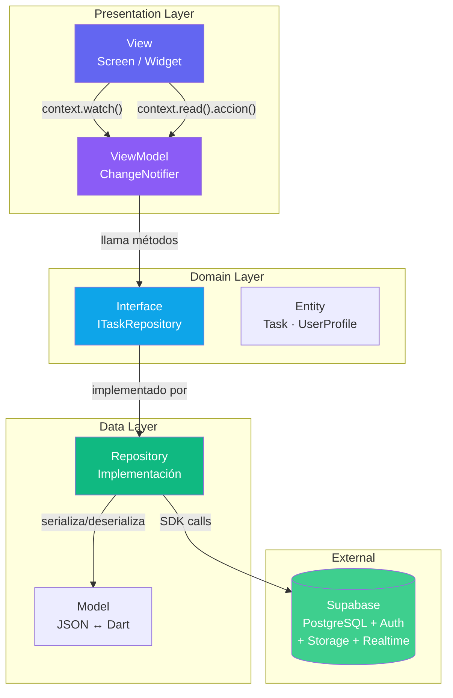
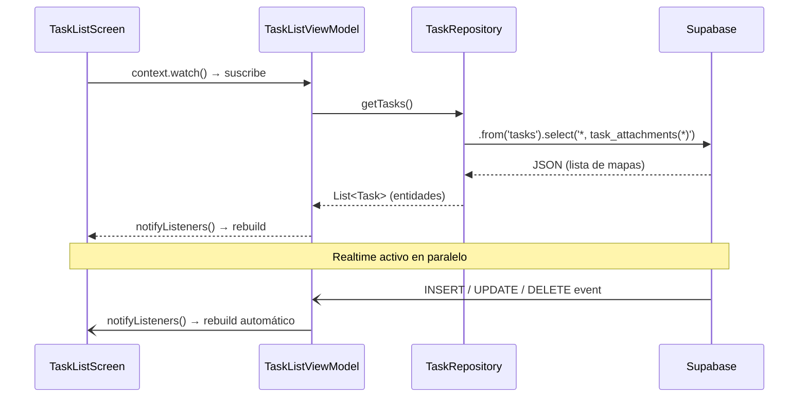
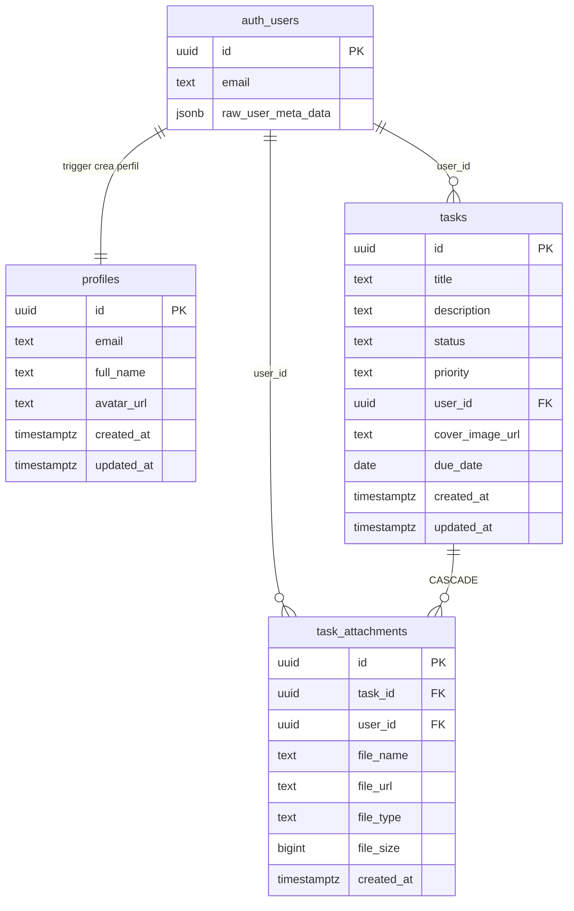

# TaskBoard — Flutter + Supabase

> Aplicación educativa de gestión de tareas estilo mini-Trello.  
> Curso: **Desarrollo de Aplicaciones Multiplataforma**

Este repositorio es una **guía de referencia completa**. Úsalo de dos formas:

- **Construir desde cero** → sigue esta guía paso a paso (recomendado para aprender).
- **Clonar y explorar** → ve directamente a [Inicio rápido](#inicio-rápido-clonar-el-repo).

---

## ¿Qué aprenderás?

| Flutter | Supabase |
|---|---|
| Patrón MVVM con `provider` + `ChangeNotifier` | Auth: email/password + OAuth (Google, GitHub) |
| Navegación declarativa con GoRouter + auth guard | Database: CRUD con PostgREST (`.select`, `.insert`, `.update`, `.delete`) |
| Formularios con validación del lado del cliente | Realtime: actualizaciones automáticas sin refresh |
| Subida de imágenes y documentos | Storage: bucket público vs. bucket privado + URLs firmadas |
| Skeleton loading con shimmer | Row Level Security (RLS): cada usuario solo ve sus datos |

---

## Arquitectura MVVM



### Flujo de datos — cargar tareas con Realtime



---

## Esquema de base de datos



---

## Inicio rápido (clonar el repo)

```bash
git clone https://github.com/sergiodev3/flutter_supabase_app_proyectos.git
cd flutter_supabase_app_proyectos

# 1. Copia el archivo de variables de entorno
cp .env.example .env
# Edita .env con tus claves de Supabase (ver Fase 2 abajo)

# 2. Instala dependencias
flutter pub get

# 3. Corre la app
flutter run
```

> Antes de correr la app necesitas configurar el proyecto en Supabase.
> Ve a [Fase 2 — Configurar Supabase](#fase-2--configurar-supabase).

---

---

# Guía completa: construir el proyecto desde cero

> Sigue cada fase en orden. Al final tendrás exactamente la misma app que está en este repo.

---

## Fase 1 — Crear el proyecto Flutter

### 1.1 Crear la app

Abre tu terminal y ejecuta:

```bash
flutter create taskboard_app --org com.tuempresa
cd taskboard_app
```

> El flag `--org` define el identificador del paquete Android/iOS. Cámbialo por tu dominio inverso.

### 1.2 Limpiar el código de ejemplo

Reemplaza todo el contenido de `lib/main.dart` con este código mínimo
(lo iremos completando más adelante):

```dart
import 'package:flutter/material.dart';

void main() {
  runApp(const MaterialApp(home: Scaffold(body: Center(child: Text('Hola')))));
}
```

Borra también el archivo `test/widget_test.dart` o déjalo vacío por ahora.

### 1.3 Crear la estructura de carpetas

Desde la raíz del proyecto ejecuta:

```bash
mkdir -p lib/core/{config,constants,errors,router,theme}
mkdir -p lib/domain/{entities,repositories}
mkdir -p lib/data/{models,repositories}
mkdir -p lib/presentation/{viewmodels,widgets/{common,task}}
mkdir -p lib/presentation/screens/{auth,tasks,profile,splash}
mkdir -p supabase
mkdir -p assets/images
```

La estructura final de `lib/` se verá así:

```
lib/
├── core/
│   ├── config/          ← env.dart
│   ├── constants/       ← app_constants.dart
│   ├── errors/          ← app_exception.dart
│   ├── router/          ← app_router.dart
│   └── theme/           ← app_theme.dart
├── domain/
│   ├── entities/        ← task.dart, user_profile.dart
│   └── repositories/    ← i_auth_repository.dart, i_task_repository.dart, i_storage_repository.dart
├── data/
│   ├── models/          ← task_model.dart, task_attachment_model.dart, user_profile_model.dart
│   └── repositories/    ← auth_repository.dart, task_repository.dart, storage_repository.dart
├── presentation/
│   ├── viewmodels/      ← auth_viewmodel.dart, task_list_viewmodel.dart, ...
│   ├── screens/
│   │   ├── auth/        ← login_screen.dart, register_screen.dart
│   │   ├── tasks/       ← task_list_screen.dart, task_form_screen.dart, task_detail_screen.dart
│   │   ├── profile/     ← profile_screen.dart
│   │   └── splash/      ← splash_screen.dart
│   └── widgets/
│       ├── common/      ← app_button.dart, app_text_field.dart, loading_overlay.dart
│       └── task/        ← task_card.dart, status_chip.dart
└── main.dart
```

---

## Fase 2 — Configurar Supabase

### 2.1 Crear el proyecto en Supabase

1. Ve a [supabase.com](https://supabase.com) y crea una cuenta gratuita.
2. Haz clic en **New Project**.
3. Elige un nombre, una contraseña segura y la región más cercana a ti.
4. Espera ~2 minutos a que el proyecto se aprovisione.

### 2.2 Ejecutar los scripts SQL

Ve a tu dashboard → **SQL Editor** → **New Query** y ejecuta cada archivo **en este orden**:

**Paso A — schema.sql** (tablas, triggers, funciones)

Copia el contenido de [`supabase/schema.sql`](supabase/schema.sql) y haz clic en **Run**.

Esto crea:
- `profiles` — perfil público del usuario (extiende `auth.users`)
- `tasks` — tareas con status y priority como CHECK constraints
- `task_attachments` — adjuntos con ON DELETE CASCADE
- Trigger `handle_new_user` — crea el perfil automáticamente al registrarse
- Función `handle_updated_at` — actualiza `updated_at` automáticamente

**Paso B — rls_policies.sql** (seguridad por filas)

Copia el contenido de [`supabase/rls_policies.sql`](supabase/rls_policies.sql) y ejecútalo.

> ⭐ **Row Level Security es la joya de Supabase.**
> Sin estas políticas, cualquier usuario autenticado vería los datos de todos.
> Con ellas, PostgreSQL filtra automáticamente usando `auth.uid() = user_id`.

**Paso C — storage_setup.sql** (buckets)

Copia el contenido de [`supabase/storage_setup.sql`](supabase/storage_setup.sql) y ejecútalo.

Esto crea dos buckets con propósitos distintos:

| Bucket | Tipo | Para qué | URL |
|---|---|---|---|
| `task-covers` | **Público** | Imágenes de portada | Directa, sin expiración |
| `task-documents` | **Privado** | PDF, DOCX adjuntos | Firmada, expira en 1 hora |

### 2.3 Verificar la configuración

| Lugar en el dashboard | Qué deberías ver |
|---|---|
| **Table Editor** | Tablas: `profiles`, `tasks`, `task_attachments` |
| **Storage** | Buckets: `task-covers` 🌐 y `task-documents` 🔒 |
| **Authentication > Policies** | Políticas activas en las 3 tablas |

### 2.4 Obtener las credenciales

Ve a **Project Settings → API** y copia:
- **Project URL** → `https://xxxx.supabase.co`
- **anon public key** → el JWT largo que empieza con `eyJ...`

Las necesitarás en el siguiente paso.

---

## Fase 3 — Instalar dependencias

### 3.1 Instalar los paquetes

Desde la terminal dentro de tu proyecto Flutter:

```bash
flutter pub add supabase_flutter provider go_router image_picker file_picker cached_network_image shimmer intl flutter_dotenv uuid timeago path url_launcher google_fonts
```

Este único comando instala todos los paquetes y actualiza `pubspec.yaml` automáticamente.

### 3.2 Declarar assets en pubspec.yaml

Abre `pubspec.yaml` y agrega la sección `assets` dentro de `flutter:`:

```yaml
flutter:
  uses-material-design: true
  assets:
    - .env              # Variables de entorno
    - assets/images/    # Imágenes locales
```

> **¿Por qué declarar `.env` como asset?**
> `flutter_dotenv` lee el archivo `.env` desde el bundle de la app.
> Si no lo declaras aquí, la app no lo encontrará en tiempo de ejecución.

### 3.3 Crear el archivo .env

En la raíz del proyecto crea el archivo `.env` (al mismo nivel que `pubspec.yaml`):

```
SUPABASE_URL=https://TU-PROYECTO.supabase.co
SUPABASE_ANON_KEY=eyJhbGciOiJIUzI1NiIsInR5cCI6IkpXVCJ9...
```

Y crea también `.env.example` con los mismos campos pero sin los valores reales.
Ese archivo sí se sube al repo para que otros sepan qué configurar.

### 3.4 Proteger las credenciales en .gitignore

Abre `.gitignore` y agrega al inicio:

```
# Credenciales — NUNCA subir al repositorio
.env
```

> Si subes el `.env` a GitHub con claves reales, cualquiera podría
> acceder a tu proyecto de Supabase. La `anon key` es segura en el cliente
> **solo porque RLS la protege**, pero la contraseña de la BD no debe exponerse nunca.

---

## Fase 4 — Capa Core

La capa core es la infraestructura compartida. No conoce ni a Supabase ni a Flutter UI.

### 4.1 Variables de entorno — `lib/core/config/env.dart`

```dart
import 'package:flutter_dotenv/flutter_dotenv.dart';

class Env {
  Env._();

  static Future<void> load() => dotenv.load(fileName: '.env');

  static String get supabaseUrl    => dotenv.env['SUPABASE_URL']!;
  static String get supabaseAnonKey => dotenv.env['SUPABASE_ANON_KEY']!;
}
```

### 4.2 Constantes — `lib/core/constants/app_constants.dart`

Define aquí los nombres de tablas, buckets y rutas. Al centralizar los strings
evitas errores por typos y facilitas el refactoring.

```dart
class SupabaseTables {
  static const String profiles    = 'profiles';
  static const String tasks       = 'tasks';
  static const String attachments = 'task_attachments';
}

class StorageBuckets {
  static const String covers    = 'task-covers';
  static const String documents = 'task-documents';
}

class TaskStatus {
  static const String todo       = 'todo';
  static const String inProgress = 'in_progress';
  static const String done       = 'done';
}

class TaskPriority {
  static const String low    = 'low';
  static const String medium = 'medium';
  static const String high   = 'high';
}

class AppRoutes {
  static const String splash     = '/';
  static const String login      = '/login';
  static const String register   = '/register';
  static const String taskList   = '/tasks';
  static const String taskNew    = '/tasks/new';
  static const String taskEdit   = '/tasks/:id/edit';
  static const String taskDetail = '/tasks/:id';
  static const String profile    = '/profile';
}
```

### 4.3 Excepciones tipadas — `lib/core/errors/app_exception.dart`

Los repositorios capturan errores de Supabase (`PostgrestException`,
`StorageException`, etc.) y los convierten en estas excepciones propias.
Los ViewModels solo conocen `AppException`, no saben nada de Supabase.

```dart
sealed class AppException implements Exception {
  const AppException(this.message);
  final String message;
}

class AuthException    extends AppException { const AuthException(super.message); }
class DatabaseException extends AppException { const DatabaseException(super.message); }
class StorageException  extends AppException { const StorageException(super.message); }
class UnauthenticatedException extends AppException {
  const UnauthenticatedException() : super('Debes iniciar sesión para continuar.');
}
class NetworkException extends AppException {
  const NetworkException([super.message = 'Error de red. Revisa tu conexión.']);
}
```

### 4.4 Tema — `lib/core/theme/app_theme.dart`

Centraliza colores y estilos de Material 3. Consulta el archivo completo
en el repo: [`lib/core/theme/app_theme.dart`](lib/core/theme/app_theme.dart).

---

## Fase 5 — Capa Domain

La capa de dominio contiene las **reglas de negocio puras**.
No importa nada de Supabase, Flutter ni ninguna librería.
Es código Dart puro, fácilmente testeable.

### 5.1 Entidades

**`lib/domain/entities/task.dart`**

```dart
class Task {
  const Task({
    required this.id,
    required this.title,
    required this.userId,
    required this.status,
    required this.priority,
    required this.createdAt,
    required this.updatedAt,
    this.description,
    this.coverImageUrl,
    this.dueDate,
    this.attachments = const [],
  });

  final String id;
  final String title;
  final String? description;
  final String status;       // Usa las constantes de TaskStatus
  final String priority;     // Usa las constantes de TaskPriority
  final String userId;
  final String? coverImageUrl;
  final DateTime? dueDate;
  final DateTime createdAt;
  final DateTime updatedAt;
  final List<TaskAttachment> attachments;

  Task copyWith({ /* ... campos opcionales ... */ }) => Task( /* ... */ );
}

class TaskAttachment {
  // id, taskId, userId, fileName, fileUrl, fileType, fileSize, createdAt
  String get formattedSize { /* devuelve "1.2 MB" */ }
}
```

Código completo: [`lib/domain/entities/task.dart`](lib/domain/entities/task.dart)

**`lib/domain/entities/user_profile.dart`**

```dart
class UserProfile {
  const UserProfile({
    required this.id,
    required this.email,
    required this.createdAt,
    this.fullName,
    this.avatarUrl,
  });

  // displayName usa fullName si existe, sino el prefijo del email
  String get displayName => fullName ?? email.split('@').first;
}
```

### 5.2 Interfaces de repositorio (contratos)

Las interfaces definen **qué** hacen los repositorios, sin especificar **cómo**.
Esto permite:
- Cambiar de Supabase a Firebase sin tocar los ViewModels.
- Usar mocks en tests unitarios.

**`lib/domain/repositories/i_task_repository.dart`**

```dart
abstract interface class ITaskRepository {
  Future<List<Task>> getTasks();
  Future<Task>       getTaskById(String id);
  Future<Task>       createTask({ required String title, String? description,
                                   required String status, required String priority,
                                   DateTime? dueDate, String? coverImageUrl });
  Future<Task>       updateTask({ required String id, String? title, /* ... */ });
  Future<void>       deleteTask(String id);
  Future<TaskAttachment> addAttachment({ /* ... */ });
  Future<void>       deleteAttachment(String attachmentId);
  Stream<List<Task>> watchTasks();   // ← Realtime
}
```

Archivos completos en el repo:
[`i_auth_repository.dart`](lib/domain/repositories/i_auth_repository.dart) |
[`i_task_repository.dart`](lib/domain/repositories/i_task_repository.dart) |
[`i_storage_repository.dart`](lib/domain/repositories/i_storage_repository.dart)

---

## Fase 6 — Capa Data

### 6.1 Modelos (serialización JSON)

Los modelos extienden las entidades y añaden `fromJson` / `toJson`.
Saben cómo convertir la respuesta de Supabase (Map) a un objeto Dart.

**`lib/data/models/task_model.dart`** — fragmento clave:

```dart
class TaskModel extends Task {
  // Constructor con super parameters...

  factory TaskModel.fromJson(Map<String, dynamic> json) {
    final attachmentsJson = json['task_attachments'] as List<dynamic>? ?? [];

    return TaskModel(
      id:          json['id']           as String,
      title:       json['title']        as String,
      status:      json['status']       as String,
      priority:    json['priority']     as String,
      userId:      json['user_id']      as String,          // ← snake_case de Supabase
      coverImageUrl: json['cover_image_url'] as String?,
      dueDate:     json['due_date'] != null
                     ? DateTime.parse(json['due_date'] as String)
                     : null,
      createdAt:   DateTime.parse(json['created_at'] as String),
      updatedAt:   DateTime.parse(json['updated_at'] as String),
      attachments: attachmentsJson
          .map((a) => TaskAttachmentModel.fromJson(a as Map<String, dynamic>))
          .toList(),
      // ...
    );
  }

  Map<String, dynamic> toInsertJson() => {
    'title':       title,
    'description': description,
    'status':      status,
    'priority':    priority,
    'due_date':    dueDate?.toIso8601String().split('T').first,
    // NO incluimos id, user_id, created_at → los genera Supabase automáticamente
  };
}
```

> **Patrón importante**: Supabase usa `snake_case` en la BD.
> Dart usa `camelCase`. El modelo convierte entre ambos en `fromJson` / `toJson`.

Código completo:
[`task_model.dart`](lib/data/models/task_model.dart) |
[`task_attachment_model.dart`](lib/data/models/task_attachment_model.dart) |
[`user_profile_model.dart`](lib/data/models/user_profile_model.dart)

### 6.2 Repositorios (implementaciones)

Aquí es donde **realmente usas la API de Supabase**.
Cada método implementa un contrato de la interfaz.

**`lib/data/repositories/task_repository.dart`** — los 4 métodos CRUD:

```dart
class TaskRepository implements ITaskRepository {
  TaskRepository(this._supabase);
  final SupabaseClient _supabase;

  // ── SELECT ────────────────────────────────────────────────────────────────
  // El * trae todos los campos de tasks.
  // task_attachments(*) hace un JOIN automático usando la FK task_id.
  // RLS filtra automáticamente WHERE user_id = auth.uid() — ¡sin escribirlo!
  @override
  Future<List<Task>> getTasks() async {
    final data = await _supabase
        .from('tasks')
        .select('*, task_attachments(*)')
        .order('created_at', ascending: false);
    return (data as List).map((j) => TaskModel.fromJson(j)).toList();
  }

  // ── INSERT ────────────────────────────────────────────────────────────────
  // .select().single() le dice a Supabase que devuelva el registro creado.
  @override
  Future<Task> createTask({ required String title, /* ... */ }) async {
    final data = await _supabase
        .from('tasks')
        .insert({ 'title': title, 'user_id': _userId, /* ... */ })
        .select('*, task_attachments(*)')
        .single();
    return TaskModel.fromJson(data);
  }

  // ── UPDATE ────────────────────────────────────────────────────────────────
  @override
  Future<Task> updateTask({ required String id, String? title, /* ... */ }) async {
    final data = await _supabase
        .from('tasks')
        .update({ if (title != null) 'title': title, /* ... */ })
        .eq('id', id)
        .select('*, task_attachments(*)')
        .single();
    return TaskModel.fromJson(data);
  }

  // ── DELETE ────────────────────────────────────────────────────────────────
  // ON DELETE CASCADE en la FK elimina también los task_attachments.
  @override
  Future<void> deleteTask(String id) async {
    await _supabase.from('tasks').delete().eq('id', id);
  }

  // ── REALTIME ──────────────────────────────────────────────────────────────
  // .stream() mantiene una conexión WebSocket abierta.
  // Cada cambio en la tabla emite la lista completa actualizada.
  @override
  Stream<List<Task>> watchTasks() {
    return _supabase
        .from('tasks')
        .stream(primaryKey: ['id'])
        .eq('user_id', _userId)
        .order('created_at', ascending: false)
        .map((rows) => rows.map(TaskModel.fromJson).toList());
  }
}
```

Código completo:
[`auth_repository.dart`](lib/data/repositories/auth_repository.dart) |
[`task_repository.dart`](lib/data/repositories/task_repository.dart) |
[`storage_repository.dart`](lib/data/repositories/storage_repository.dart)

---

## Fase 7 — ViewModels (MVVM)

El ViewModel es el intermediario entre la pantalla y el repositorio.

**Responsabilidades:**
1. Expone estado observable: `isLoading`, `errorMessage`, `tasks`.
2. Ejecuta lógica cuando la pantalla llama un método.
3. Notifica a la pantalla cuando el estado cambia con `notifyListeners()`.
4. **No conoce nada de Flutter UI** — sin `BuildContext`, sin `Widget`.

**Patrón de uso en la pantalla:**
```dart
// Suscribirse a cambios (reconstruye el widget):
final vm = context.watch<TaskListViewModel>();

// Llamar una acción (no reconstruye):
context.read<TaskListViewModel>().deleteTask(id);
```

### 7.1 AuthViewModel — `lib/presentation/viewmodels/auth_viewmodel.dart`

```dart
class AuthViewModel extends ChangeNotifier {
  AuthViewModel(this._authRepository);
  final IAuthRepository _authRepository;

  bool _isLoading = false;
  String? _errorMessage;

  bool get isLoading => _isLoading;
  String? get errorMessage => _errorMessage;

  Future<bool> signIn({ required String email, required String password }) =>
      _run(() => _authRepository.signInWithEmail(email: email, password: password));

  Future<bool> signUp({ required String email, required String password, String? fullName }) =>
      _run(() => _authRepository.signUpWithEmail(email: email, password: password, fullName: fullName));

  Future<bool> signInWithGoogle() => _run(() => _authRepository.signInWithGoogle());
  Future<bool> signOut()          => _run(() => _authRepository.signOut());

  // Plantilla: activa loading → ejecuta → captura error → desactiva loading
  Future<bool> _run(Future<void> Function() action) async {
    _isLoading = true;
    _errorMessage = null;
    notifyListeners();
    try {
      await action();
      return true;
    } on AppException catch (e) {
      _errorMessage = e.message;
      return false;
    } finally {
      _isLoading = false;
      notifyListeners();
    }
  }
}
```

### 7.2 TaskListViewModel — `lib/presentation/viewmodels/task_list_viewmodel.dart`

Este ViewModel demuestra cómo conectar Realtime a la UI:

```dart
class TaskListViewModel extends ChangeNotifier {
  TaskListViewModel(this._taskRepository) {
    loadTasks();           // Carga inicial (snapshot)
    _subscribeRealtime();  // Luego activa el stream en vivo
  }

  StreamSubscription<List<Task>>? _sub;

  void _subscribeRealtime() {
    _sub = _taskRepository.watchTasks().listen((tasks) {
      _tasks = tasks;
      notifyListeners(); // ← La pantalla se reconstruye automáticamente
    });
  }

  @override
  void dispose() {
    _sub?.cancel(); // ← MUY IMPORTANTE: cancela el WebSocket al salir
    super.dispose();
  }
}
```

Archivos completos:
[`auth_viewmodel.dart`](lib/presentation/viewmodels/auth_viewmodel.dart) |
[`task_list_viewmodel.dart`](lib/presentation/viewmodels/task_list_viewmodel.dart) |
[`task_form_viewmodel.dart`](lib/presentation/viewmodels/task_form_viewmodel.dart) |
[`task_detail_viewmodel.dart`](lib/presentation/viewmodels/task_detail_viewmodel.dart) |
[`profile_viewmodel.dart`](lib/presentation/viewmodels/profile_viewmodel.dart)

---

## Fase 8 — Widgets reutilizables

Crea estos componentes antes de las pantallas, porque las pantallas los usan.

| Archivo | Descripción |
|---|---|
| [`widgets/common/app_button.dart`](lib/presentation/widgets/common/app_button.dart) | Botón con estado de carga y variante outlined |
| [`widgets/common/app_text_field.dart`](lib/presentation/widgets/common/app_text_field.dart) | Campo de texto con label, validación y prefixIcon |
| [`widgets/common/loading_overlay.dart`](lib/presentation/widgets/common/loading_overlay.dart) | Overlay semitransparente que bloquea la UI mientras carga |
| [`widgets/task/task_card.dart`](lib/presentation/widgets/task/task_card.dart) | Tarjeta de tarea: imagen, título, chips, fecha |
| [`widgets/task/status_chip.dart`](lib/presentation/widgets/task/status_chip.dart) | Chip coloreado según el estado de la tarea |

---

## Fase 9 — Pantallas

Crea las pantallas en este orden (de menor a mayor complejidad):

### 9.1 Splash — `lib/presentation/screens/splash/splash_screen.dart`

Pantalla de carga inicial. GoRouter redirige automáticamente cuando
Supabase termina de verificar si hay sesión activa guardada.

```dart
class SplashScreen extends StatelessWidget {
  @override
  Widget build(BuildContext context) {
    return const Scaffold(
      backgroundColor: AppColors.primary,
      body: Center(child: Column(
        mainAxisSize: MainAxisSize.min,
        children: [
          Icon(Icons.check_circle_outline_rounded, size: 80, color: Colors.white),
          Text('TaskBoard', style: TextStyle(color: Colors.white, fontSize: 28)),
          SizedBox(height: 48),
          CircularProgressIndicator(color: Colors.white54),
        ],
      )),
    );
  }
}
```

### 9.2 Login — `lib/presentation/screens/auth/login_screen.dart`

Puntos clave del código:

```dart
class _LoginScreenState extends State<LoginScreen> {
  final _formKey = GlobalKey<FormState>(); // ← Controla el Form
  final _emailController    = TextEditingController();
  final _passwordController = TextEditingController();

  Future<void> _signIn() async {
    if (!_formKey.currentState!.validate()) return; // ← Valida todos los campos

    final vm = context.read<AuthViewModel>();         // ← Lee sin suscribirse
    final ok = await vm.signIn(
      email:    _emailController.text.trim(),
      password: _passwordController.text,
    );
    if (ok && mounted) context.go(AppRoutes.taskList);
  }

  @override
  Widget build(BuildContext context) {
    final vm = context.watch<AuthViewModel>(); // ← Suscribe y reconstruye
    return Scaffold(
      body: Form(
        key: _formKey,
        child: Column(children: [
          // ... campos y botones ...
          AppButton(label: 'Iniciar sesión', onPressed: _signIn, isLoading: vm.isLoading),
          // OAuth
          AppButton(label: 'Google', onPressed: () => vm.signInWithGoogle()),
          AppButton(label: 'GitHub', onPressed: () => vm.signInWithGithub()),
        ]),
      ),
    );
  }
}
```

Código completo de cada pantalla:
[`login_screen.dart`](lib/presentation/screens/auth/login_screen.dart) |
[`register_screen.dart`](lib/presentation/screens/auth/register_screen.dart) |
[`task_list_screen.dart`](lib/presentation/screens/tasks/task_list_screen.dart) |
[`task_form_screen.dart`](lib/presentation/screens/tasks/task_form_screen.dart) |
[`task_detail_screen.dart`](lib/presentation/screens/tasks/task_detail_screen.dart) |
[`profile_screen.dart`](lib/presentation/screens/profile/profile_screen.dart)

---

## Fase 10 — Enrutador con auth guard

### `lib/core/router/app_router.dart`

GoRouter evalúa la función `redirect` en **cada navegación**.
Esto implementa el auth guard: protege rutas sin repetir código.

```dart
GoRouter createRouter({ required IAuthRepository authRepository, /* ... */ }) {
  return GoRouter(
    initialLocation: AppRoutes.splash,

    // refreshListenable conecta el stream de auth con el router.
    // Cada login/logout hace que GoRouter re-evalúe todos los redirects.
    refreshListenable: _AuthChangeListenable(authRepository),

    redirect: (context, state) {
      final isAuthenticated = authRepository.currentUser != null;
      final location = state.matchedLocation;
      final isPublic = location == AppRoutes.login || location == AppRoutes.register;

      if (!isAuthenticated && !isPublic) return AppRoutes.login;  // ← Protege rutas
      if (isAuthenticated  && isPublic)  return AppRoutes.taskList; // ← Evita login duplicado
      return null; // null = sin redirección
    },

    routes: [
      GoRoute(
        path: AppRoutes.taskList,
        builder: (ctx, _) => ChangeNotifierProvider(
          // El ViewModel se crea en la ruta, no en la pantalla.
          // Así se destruye al salir de la ruta (evita memory leaks).
          create: (_) => TaskListViewModel(taskRepository),
          child: const TaskListScreen(),
        ),
      ),
      // ... demás rutas ...
    ],
  );
}

// Conecta Stream<User?> con Listenable para que GoRouter lo escuche
class _AuthChangeListenable extends ChangeNotifier {
  _AuthChangeListenable(IAuthRepository auth) {
    _sub = auth.authStateChanges.listen((_) => notifyListeners());
  }
  late final StreamSubscription _sub;
  @override
  void dispose() { _sub.cancel(); super.dispose(); }
}
```

Código completo: [`app_router.dart`](lib/core/router/app_router.dart)

---

## Fase 11 — main.dart

El punto de entrada inicializa todo en el orden correcto:

```dart
Future<void> main() async {
  WidgetsFlutterBinding.ensureInitialized(); // 1. Necesario para usar plugins antes de runApp

  await Env.load();                          // 2. Carga el .env

  await Supabase.initialize(                 // 3. Conecta con Supabase
    url:     Env.supabaseUrl,
    anonKey: Env.supabaseAnonKey,
  );

  await initializeDateFormatting('es', null); // 4. Fechas en español

  runApp(const TaskBoardApp());              // 5. Lanza la UI
}

class TaskBoardApp extends StatelessWidget {
  @override
  Widget build(BuildContext context) {
    final supabase = Supabase.instance.client;  // Singleton

    // Crear implementaciones concretas una sola vez (nivel raíz)
    final IAuthRepository    auth    = AuthRepository(supabase);
    final ITaskRepository    tasks   = TaskRepository(supabase);
    final IStorageRepository storage = StorageRepository(supabase);

    return MultiProvider(
      providers: [
        Provider<IAuthRepository>.value(value: auth),
        Provider<ITaskRepository>.value(value: tasks),
        Provider<IStorageRepository>.value(value: storage),
      ],
      child: MaterialApp.router(
        title: 'TaskBoard',
        theme: AppTheme.light,
        routerConfig: createRouter(
          authRepository:    auth,
          taskRepository:    tasks,
          storageRepository: storage,
        ),
        debugShowCheckedModeBanner: false,
      ),
    );
  }
}
```

Código completo: [`main.dart`](lib/main.dart)

---

## Dependencias — referencia rápida

| Paquete | Propósito |
|---|---|
| `supabase_flutter` | SDK oficial: Auth, Database, Realtime, Storage |
| `provider` | `ChangeNotifier` → `ViewModel` (MVVM) |
| `go_router` | Navegación declarativa + auth guard |
| `image_picker` | Seleccionar foto de galería/cámara |
| `file_picker` | Seleccionar PDF, DOCX, etc. |
| `cached_network_image` | Caché de imágenes de Storage |
| `shimmer` | Skeleton loading mientras cargan datos |
| `intl` | Fechas en español (`dd MMM yyyy`) |
| `uuid` | IDs únicos para archivos en Storage |
| `timeago` | "hace 2 horas", "ayer" |
| `path` | Extraer extensión de archivo (`.pdf`, `.jpg`) |
| `url_launcher` | Abrir URLs firmadas en navegador/lector |
| `google_fonts` | Tipografía Inter para la UI |
| `flutter_dotenv` | Leer `SUPABASE_URL` y `SUPABASE_ANON_KEY` del `.env` |

---

## Laboratorios — experimenta con los conceptos

### Lab 1 — Inspeccionar el JWT

Después de hacer login, imprime el token en consola:

```dart
final session = Supabase.instance.client.auth.currentSession;
print(session?.accessToken);
```

Pega ese token en [jwt.io](https://jwt.io) y observa:
- `sub` → el UUID del usuario
- `exp` → cuándo expira (1 hora por defecto)
- `role` → `authenticated`

### Lab 2 — Desactivar RLS y ver la diferencia

1. En Supabase: **Authentication → Policies → tasks → desactiva RLS**.
2. Crea dos cuentas y agrega tareas con cada una.
3. Consulta en el SQL Editor: `SELECT * FROM tasks;` → ves TODAS las tareas.
4. Reactiva RLS → la misma consulta como usuario normal solo devuelve las suyas.

### Lab 3 — Realtime en dos dispositivos

1. Abre la app en dos emuladores (o un emulador y un dispositivo físico).
2. Inicia sesión con la misma cuenta en ambos.
3. Crea una tarea en uno → ¿aparece en el otro sin recargar?

### Lab 4 — URL pública vs. URL firmada

```dart
// URL pública → funciona siempre
final pub = supabase.storage.from('task-covers').getPublicUrl('path/cover.jpg');

// URL firmada → expira en 60 segundos
final signed = await supabase.storage.from('task-documents').createSignedUrl('path/doc.pdf', 60);

// Intenta abrir la URL firmada después de 60 segundos → 400 Expired
```

### Lab 5 — Añadir un campo nuevo a la base de datos

1. Ejecuta en SQL Editor: `ALTER TABLE tasks ADD COLUMN tags TEXT[] DEFAULT '{}';`
2. Actualiza `TaskModel.fromJson` para leer `json['tags']`.
3. Actualiza `TaskFormScreen` para permitir agregar etiquetas.

Este flujo (BD → Modelo → ViewModel → UI) resume toda la arquitectura.

---

## Preguntas frecuentes

**¿Por qué MVVM y no solo `setState`?**  
`setState` es perfecto para estado local y simple. Pero cuando la lógica
crece (auth, llamadas a API, manejo de errores), mezclar todo en el Widget
hace el código difícil de mantener y de probar. MVVM separa responsabilidades.

**¿Por qué `provider` y no Riverpod o Bloc?**  
`provider` + `ChangeNotifier` tiene la menor fricción para aprender MVVM.
Los principios son idénticos en Riverpod o Bloc. Una vez que entiendas
este patrón, migrar a otra solución es sencillo.

**¿Es seguro usar la `anon key` en el código del cliente?**  
Sí, **si RLS está activado**. La `anon key` solo tiene permisos para
lo que tus políticas permiten. Sin RLS activado sería un problema de seguridad
porque cualquier usuario autenticado podría leer/modificar todos los datos.

**¿Cómo genero el APK para compartir con mis compañeros?**

```bash
flutter build apk --release         # APK para Android
flutter build appbundle             # Bundle para Google Play
flutter build web                   # Versión web
```

---

## Recursos

- [Documentación Supabase](https://supabase.com/docs)
- [SDK Dart de Supabase](https://supabase.com/docs/reference/dart/introduction)
- [GoRouter](https://pub.dev/packages/go_router)
- [Provider](https://pub.dev/packages/provider)
- [Flutter oficial](https://flutter.dev/docs)

---

## Licencia

MIT — Libre para uso educativo y proyectos personales.
